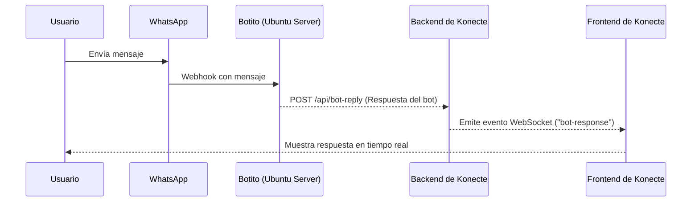

# Guía de Integración de WebSocket entre Botito y Konecte

Este documento describe los pasos para implementar comunicación en tiempo real entre el bot de WhatsApp (Botito) y la aplicación Konecte utilizando `socket.io`. El objetivo es que las respuestas del bot se muestren instantáneamente en el chat de Konecte sin necesidad de recargar la página.

## Diagrama de Flujo



---

## Paso 1: Backend de Konecte - Configurar Servidor WebSocket

Primero, necesitas agregar `socket.io` a tu backend de Konecte y configurarlo para que funcione junto a tu servidor Express existente.

1.  **Instalar `socket.io`:**

    ```bash
    npm install socket.io
    # O si usas yarn
    yarn add socket.io
    ```

2.  **Modificar el archivo principal del servidor (ej. `server.js` o `index.js`):**

    Debes envolver tu servidor Express con el módulo `http` de Node y luego adjuntar `socket.io`.

    ```javascript
    // Importaciones necesarias
    const express = require('express');
    const http = require('http');
    const { Server } = require("socket.io");
    const cors = require('cors');

    const app = express();
    app.use(cors()); // Asegúrate de tener una política de CORS adecuada
    app.use(express.json());

    // Crea el servidor HTTP a partir de la app de Express
    const server = http.createServer(app);

    // Inicializa socket.io
    const io = new Server(server, {
      cors: {
        origin: "*", // ¡IMPORTANTE!: En producción, restringe esto a tu dominio del frontend.
        methods: ["GET", "POST"]
      }
    });

    // Almacenará los sockets de los clientes conectados, usando el número de WhatsApp como clave.
    let connectedClients = {};

    // Lógica de conexión de Socket.io
    io.on('connection', (socket) => {
      const userPhoneNumber = socket.handshake.query.userPhone;
      console.log(`Un cliente se ha conectado: ${socket.id} para el usuario ${userPhoneNumber}`);

      if (userPhoneNumber) {
        connectedClients[userPhoneNumber] = socket;
        console.log(`Socket registrado para el número: ${userPhoneNumber}`);
      }

      socket.on('disconnect', () => {
        console.log(`Cliente desconectado: ${socket.id}`);
        // Eliminar el cliente del registro al desconectarse
        for (let phone in connectedClients) {
          if (connectedClients[phone].id === socket.id) {
            delete connectedClients[phone];
            console.log(`Socket para el número ${phone} eliminado.`);
            break;
          }
        }
      });
    });

    // Aquí irán tus otras rutas y el nuevo endpoint...
    // app.use('/api/users', userRoutes);

    // Endpoint para que el bot envíe las respuestas
    app.post('/api/bot-reply', (req, res) => {
        const { targetUserWhatsAppNumber, messageText } = req.body;

        if (!targetUserWhatsAppNumber || !messageText) {
            return res.status(400).json({ error: 'Faltan los parámetros targetUserWhatsAppNumber o messageText' });
        }

        const clientSocket = connectedClients[targetUserWhatsAppNumber];

        if (clientSocket) {
            console.log(`Enviando mensaje a ${targetUserWhatsAppNumber} vía WebSocket.`);
            clientSocket.emit('bot-response', {
                text: messageText,
                sender: 'bot',
                timestamp: new Date()
            });
            res.status(200).json({ success: true, message: 'Mensaje reenviado al cliente.' });
        } else {
            console.warn(`No se encontró un socket activo para el número: ${targetUserWhatsAppNumber}`);
            res.status(404).json({ success: false, message: 'El cliente no está conectado por WebSocket.' });
        }
    });


    // Iniciar el servidor
    const PORT = process.env.PORT || 3001;
    server.listen(PORT, () => {
      console.log(`Servidor de Konecte corriendo en el puerto ${PORT}`);
    });
    ```

---

## Paso 2: Frontend de Konecte - Conectar el Chat Widget

Ahora, el componente de chat en tu frontend de React (`AssistantChatWidget`) debe conectarse al servidor de WebSocket y escuchar los eventos.

1.  **Instalar el cliente de `socket.io`:**

    ```bash
    npm install socket.io-client
    # O si usas yarn
    yarn add socket.io-client
    ```

2.  **Crear/Actualizar el componente `AssistantChatWidget.tsx`:**

    Este componente establecerá una conexión WebSocket al montarse y la cerrará al desmontarse. Escuchará el evento `bot-response` para agregar los mensajes entrantes al estado del chat.

    ```tsx
    // src/components/ai/AssistantChatWidget.tsx
    import React, { useState, useEffect, useRef } from 'react';
    import io, { Socket } from 'socket.io-client';

    // Asume que tienes un backend en esta URL
    const SOCKET_SERVER_URL = 'http://localhost:3001'; // Reemplaza con la URL de tu backend

    interface Message {
      text: string;
      sender: 'user' | 'bot';
      timestamp: Date;
    }

    interface AssistantChatWidgetProps {
      // El número de teléfono del usuario de WhatsApp con el que se está chateando.
      // Es crucial para identificar la conexión correcta del socket.
      userPhone: string;
    }

    const AssistantChatWidget: React.FC<AssistantChatWidgetProps> = ({ userPhone }) => {
      const [messages, setMessages] = useState<Message[]>([]);
      const [input, setInput] = useState('');
      const socketRef = useRef<Socket | null>(null);

      useEffect(() => {
        if (!userPhone) return;

        // Conectar al servidor de WebSocket
        // Pasamos el userPhone como query para que el servidor pueda identificar esta conexión.
        socketRef.current = io(SOCKET_SERVER_URL, {
          query: { userPhone },
        });

        // Escuchar las respuestas del bot
        socketRef.current.on('bot-response', (message: Omit<Message, 'timestamp'> & { timestamp: string }) => {
          setMessages((prevMessages) => [
            ...prevMessages,
            { ...message, timestamp: new Date(message.timestamp) },
          ]);
        });

        // Limpieza al desmontar el componente
        return () => {
          if (socketRef.current) {
            socketRef.current.disconnect();
          }
        };
      }, [userPhone]);

      const handleSendMessage = (e: React.FormEvent) => {
        e.preventDefault();
        if (input.trim() === '') return;

        const userMessage: Message = {
          text: input,
          sender: 'user',
          timestamp: new Date(),
        };
        setMessages((prevMessages) => [...prevMessages, userMessage]);

        // Aquí iría la lógica para enviar el mensaje del usuario al bot
        // (por ejemplo, una llamada a una API en tu backend de Konecte,
        // que luego lo enviaría a Botito).
        console.log('Mensaje enviado al backend:', userMessage);

        setInput('');
      };

      return (
        <div className="chat-widget">
          <div className="message-list">
            {messages.map((msg, index) => (
              <div key={index} className={`message ${msg.sender}`}>
                <p>{msg.text}</p>
                <span>{msg.timestamp.toLocaleTimeString()}</span>
              </div>
            ))}
          </div>
          <form onSubmit={handleSendMessage} className="message-form">
            <input
              type="text"
              value={input}
              onChange={(e) => setInput(e.target.value)}
              placeholder="Escribe un mensaje..."
            />
            <button type="submit">Enviar</button>
          </form>
        </div>
      );
    };

    export default AssistantChatWidget;
    ```

---

## Paso 3: Configuración de "Botito"

El cambio en Botito es mínimo. Solo necesitas asegurarte de que está enviando las respuestas al nuevo endpoint del backend de Konecte.

1.  **Actualizar la URL del Webhook:**

    En tu archivo de configuración de entorno (`.env`) del proyecto Botito, cambia la variable `KONECTE_WEBHOOK_URL` para que apunte al nuevo endpoint.

    ```env
    # .env
    # ... otras variables
    KONECTE_WEBHOOK_URL=http://<IP_O_DOMINIO_DE_KONECTE>:3001/api/bot-reply
    ```

2.  **Verificar el servicio de envío:**

    Asegúrate de que la función en `whatsappService.js` envíe el payload correcto. El código del backend de Konecte ya espera los campos `targetUserWhatsAppNumber` y `messageText`, que tu servicio probablemente ya envía.

    ```javascript
    // proyectos-nodejs/botito/src/services/whatsappService.js

    async function sendMessageToKonecte(payload) {
      const webhookUrl = process.env.KONECTE_WEBHOOK_URL;
      if (!webhookUrl) return;

      try {
        console.log('Enviando mensaje a Konecte (WebSocket Bridge):', payload);
        // El payload debe contener `targetUserWhatsAppNumber` y `messageText`.
        await axios.post(webhookUrl, payload);
      } catch (error) {
        console.error('Error al enviar mensaje a Konecte (WebSocket Bridge):', error.message);
      }
    }
    ```

Con estos cambios, cuando Botito procese un mensaje y llame a `sendMessageToKonecte`, la respuesta será enviada al backend de Konecte, que a su vez la retransmitirá por WebSocket al `AssistantChatWidget` correcto, actualizando la interfaz de usuario en tiempo real. 